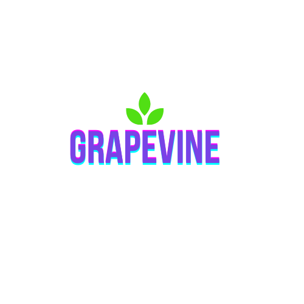

<<<<<<< HEAD

# _A Community for Plant Enthusiasts_

## GrapeVine was built in collaboration between some of the brightest students at Wyncode cohort 38.

### Kenny Suengas, Daniel Riera, Ana Maria Orduz, and Moshe Paul

#### Click this link to view it live: https://git.heroku.com/c38-grapevine.git
=======
# *A Community for Plant Enthusiasts* 

## GrapeVine was built in collaboration between some of the brightest students at Wyncode cohort 38. 
### Kenny Suengas, Daniel Riera, Ana Maria Orduz, and Moshe Paul 

#### Click this link to view it live: https://git.heroku.com/c38-grapevine.git

#### Tech Stack
Client-side | Server-side
------------ | -------------
React | MongoDB
Axios | Moongoose
React-dom | Mongoose-autopopulate
React-router-dom | JsonWebToken
Material-ui  | Passport
Heroku | Nodejs
Axios | Express
  ⠀⠀⠀⠀⠀⠀ | Faker
 ⠀⠀⠀⠀⠀⠀  | Classnames

>>>>>>> 16c36532a56d18447b49d3a3577c11285596d3ff

#### Tech Stack

| Client-side      | Server-side           |
| ---------------- | --------------------- |
| React            | MongoDB               |
| Axios            | Moongoose             |
| React-dom        | Mongoose-autopopulate |
| React-router-dom | JsonWebToken          |
| Material-ui      | Passport              |
| Heroku           | Nodejs                |
| Axios            | Express               |
| ⠀⠀⠀⠀⠀⠀           | Faker                 |
| ⠀⠀⠀⠀⠀⠀           | Classnames            |
